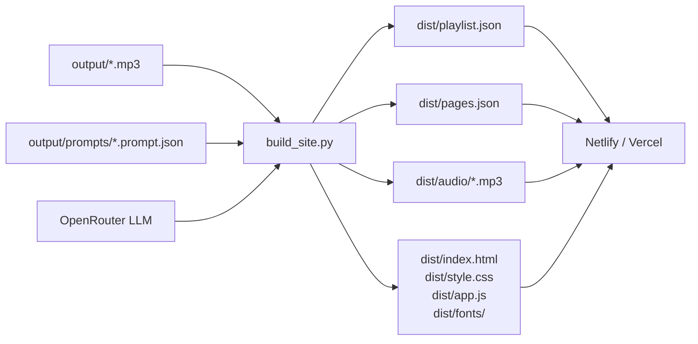
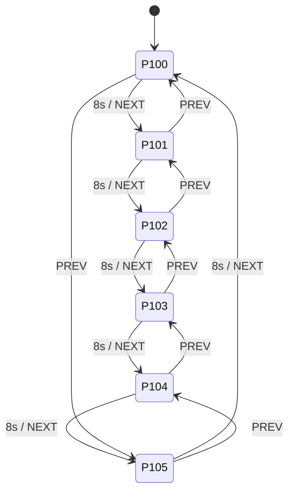

## Summary

Build a static teletext broadcast website for Dead Internet Radio. Visitors land to a fully realised teletext interface with music already playing, synchronized globally via an epoch offset. No seeking, no track selection — the station broadcasts continuously from a future date. A Python build script converts generated MP3s and metadata into a deployable `dist/` for Netlify or Vercel.

---

## Problem Frame

The generation pipeline (`generate.py`) produces MP3s and prompt JSON metadata in `output/` and `output/prompts/`. There is no listener-facing interface. The goal is a public, static website that presents the existing audio output as a continuous 24/7 broadcast, styled as a teletext service from the future.

**Scope boundary (see origin):** No generation controls on site, no live streaming, no track archive browser. Rebuild + redeploy is the content update workflow.

---

## Requirements

- Audio plays immediately (or on first gesture — autoplay policy below)
- All visitors hear the same track at the same position, synchronized via a fixed future epoch
- No seek controls, no track list
- Teletext visual system: 8-color palette, Bedstead bitmap font, 40-char × 25-row grid, `▄▄▄`/`▀▀▀` color band technique
- Six pages: P100 now-playing, P101 headlines, P102–P104 ads, P105 signal texture
- Pages auto-cycle every 8 seconds; arrow keys navigate
- Satellite dish mosaic on P100 (cyan on black, CSS grid)
- AI-generated page content (headlines + ads) at build time via existing OpenRouter LLM setup
- Deploy to Netlify or Vercel from `dist/`

**Autoplay policy:** Browser blocks audio autoplay without a user gesture. Teletext visuals and page cycling start immediately on load. Audio joins silently on first keypress or click anywhere — no overlay, no dedicated prompt page. The broadcast is already happening; the visitor tunes in by interacting.

**Epoch:** `2035-01-01T00:00:00Z` (Unix ms: `2051222400000`). The station broadcasts from after everything ended.

---

## Key Technical Decisions

**KTD1 — Duration source: mutagen over stored payload value.**
`generate.py` caps `song["duration"]` at 30s, but ACE-Step may return audio of slightly different length. `mutagen` reads actual ID3/MP4 header duration from the MP3 file. Add `mutagen>=1.47` to `requirements.txt`. Use `mutagen.mp3.MP3(path).info.length` (seconds, float) → multiply × 1000 for ms.

**KTD2 — Track deduplication: prompt-JSON-anchored MP3s win.**
Multiple MP3s may exist per track number (different generation runs). Strategy: for each `dead-internet-radio-track-{NN}-*.mp3` in `output/`, find its sibling `output/prompts/{stem}.prompt.json`. Prefer MP3s with a matched prompt JSON (full metadata). If multiple matched, take the most recently modified. If no match, skip (or use as fallback with minimal metadata). Track order is the parsed two-digit `NN` from the filename.

**KTD3 — Bedstead font: bundle as WOFF2.**
Bedstead is a free open-font designed to replicate teletext character shapes (available at bjh21.me.uk/bedstead/). Download `bedstead.woff2`, commit to `src/fonts/`. Reference via `@font-face` in CSS. No CDN dependency at runtime.

**KTD4 — Mosaic dish: 2D color-map array, CSS grid render.**
The satellite dish is defined as a JavaScript 2D array of color indices. A renderer function builds a CSS grid of `<div>` cells with `background-color`. Each cell is one teletext character position (roughly square when the font renders at natural size). Colors from the 8-color palette only. The exact dish pixel map is a design artifact iterated visually during U5.

**KTD5 — Single HTML file, vanilla JS, no bundler.**
`src/index.html` + `src/style.css` + `src/app.js`. Build script copies these verbatim into `dist/`. No Vite, no Webpack, no TypeScript. Import chain: `app.js` imports nothing — all code inline. Mosaic data lives at top of `app.js` as a `const`.

**KTD6 — LLM page content: single structured call, JSON mode.**
`build_site.py` calls the existing `call_llm()` function (imported or copied) with `json_mode=True`. One call produces the full `pages.json` structure: `{headlines: string[], ads: [{header, headerColor, lines: string[], footer: string}]}`. Three ads, five headlines. Prompt instructs the LLM to write in the deadpan bureaucratic future voice established in the brainstorm.

---

## High-Level Technical Design

### Build Pipeline



### Epoch Sync (Browser)

```mermaid
sequenceDiagram
    participant B as Browser (app.js)
    participant D as dist/ (static files)

    B->>D: fetch playlist.json
    D-->>B: {epoch, tracks[{file, durationMs, caption, bpm, key}]}
    Note over B: totalMs = sum(track.durationMs)
    Note over B: offset = (Date.now() - epoch) % totalMs
    Note over B: find track where cumulative ≤ offset < cumulative + durationMs
    Note over B: seekMs = offset - trackCumulative
    B->>D: GET audio/track-NN.mp3 (byte-range supported by CDN)
    Note over B: audio.currentTime = seekMs / 1000
    Note over B: play() deferred until first user gesture
    B->>D: fetch pages.json
    D-->>B: {headlines, ads}
    Note over B: render P100; setInterval(cyclePage, 8000)
    Note over B: addEventListener('keydown' / 'click', resumeAudio, {once:true})
```

### Page State Machine



---

## Output Structure

```
src/
  index.html          ← minimal HTML shell
  style.css           ← full teletext CSS
  app.js              ← all frontend logic
  fonts/
    bedstead.woff2    ← bundled bitmap font

build_site.py         ← build + content generation script
netlify.toml          ← deploy config (or vercel.json)

dist/                 ← gitignored, generated by build_site.py
  index.html
  style.css
  app.js
  fonts/
    bedstead.woff2
  audio/
    dead-internet-radio-track-01-*.mp3
    ...
  playlist.json
  pages.json
```

---

## Implementation Units

### U1. Build Script

**Goal:** `build_site.py` scans `output/`, matches MP3s to prompt JSONs, extracts durations, generates `playlist.json` and `pages.json` via LLM, copies everything to `dist/`.

**Requirements:** Full build workflow from origin doc. KTD1 (mutagen), KTD2 (deduplication), KTD6 (LLM page content).

**Dependencies:** None.

**Files:**
- `build_site.py` (create)
- `requirements.txt` (modify — add `mutagen>=1.47`)

**Approach:**

1. Load `.env` (for `OPENROUTER_API_KEY`).
2. Scan `output/` for files matching `dead-internet-radio-track-{NN}-*.mp3`. Parse `NN` as integer track number. Group by `NN`.
3. For each group, find the MP3 whose stem has a matching file in `output/prompts/{stem}.prompt.json`. Among matched, take the most recently modified. If none matched, use the most recently modified MP3 with minimal metadata.
4. Read matched prompt JSON: extract `payload.caption`, `payload.bpm`, `payload.keyscale` (normalize: `"A minor"` → `"A MIN"`).
5. Open each MP3 with `mutagen.mp3.MP3(path)` → `info.length` in seconds → multiply × 1000, round to int.
6. Sort tracks by `NN`. Build `playlist.json`:
   ```
   {epoch: 2051222400000, tracks: [{file: "audio/{basename}", durationMs, caption, bpm, key}]}
   ```
7. Call LLM (import `call_llm` from `generate.py` or inline an equivalent) with `json_mode=True`:
   - System prompt: instructs deadpan bureaucratic future voice (see U5 prompt spec)
   - User message: `"Generate teletext page content for Dead Internet Radio."`
   - Expected output: `{headlines: [5 strings], ads: [{header, headerColor, lines, footer}] × 3}`
8. Write `dist/playlist.json` and `dist/pages.json`.
9. `dist/audio/` — copy matched MP3s, preserving basename.
10. Copy `src/index.html`, `src/style.css`, `src/app.js`, `src/fonts/` → `dist/`.
11. Print summary: track count, total duration (mm:ss), pages generated.

**Patterns to follow:** `generate.py` — `call_llm()`, `load_dotenv()`, `Path` usage, stdout progress prints.

**Test scenarios:**
- Happy path: 5 tracks in `output/` with matching prompt JSONs → `dist/playlist.json` has 5 entries with correct metadata, `dist/audio/` has 5 MP3s, `dist/pages.json` has 5 headlines and 3 ads.
- Deduplication: two MP3s for track-01 (one with prompt JSON, one without) → the one with prompt JSON is selected.
- Missing prompt JSON: MP3 with no matching prompt JSON → included with `caption: ""`, `bpm: null`, `key: ""`.
- No MP3s in output/: script exits with clear error message.
- LLM failure (bad API key): script exits with message, does not write partial `dist/`.
- `keyscale` normalization: `"A minor"` → `"A MIN"`, `"D minor"` → `"D MIN"`, `"C major"` → `"C MAJ"`.

**Verification:** Run `python build_site.py`; inspect `dist/playlist.json` for correct track order, durations, metadata; confirm `dist/audio/` contains MP3 copies; confirm `dist/pages.json` parses as valid JSON with expected structure.

---

### U2. Static Shell — HTML + CSS + Font

**Goal:** `src/index.html` and `src/style.css` establish the teletext visual system: 40-char grid, 8-color palette, Bedstead font, color band technique, flashing animation.

**Requirements:** Full teletext visual system from origin doc. KTD3 (Bedstead), KTD5 (no bundler).

**Dependencies:** None (standalone — U3/U4/U5 fill in the JS).

**Files:**
- `src/index.html` (create)
- `src/style.css` (create)
- `src/fonts/bedstead.woff2` (download and commit)

**Approach:**

`index.html` structure:
```
<html>
  <head> charset, viewport, link style.css </head>
  <body>
    <div id="screen">          ← outermost — centers the 40-col grid
      <div id="page-header">   ← P100 DEAD INTERNET RADIO    HH:MM:SS
      <div id="page-body">     ← page content swapped by app.js
      <div id="page-nav">      ← ◄ PREV band + NEXT ► band (always visible)
    </div>
    <audio id="player" preload="auto"></audio>
    <script src="app.js"></script>
  </body>
</html>
```

`style.css` key rules:
- `@font-face` → `bedstead.woff2`, `font-family: 'Bedstead'`
- `body` → `background: #000; color: #fff; font-family: 'Bedstead', monospace; font-rendering: pixelated` (disable anti-alias via `-webkit-font-smoothing: none`)
- `#screen` → fixed width matching 40 characters at Bedstead's natural px size (approx 16px per char = 640px); centered via `margin: auto`
- Color custom properties: `--cyan: #00ffff`, `--yellow: #ffff00`, etc.
- `.band` → utility class: a 3-row color band using `before`/`after` pseudo-elements with `content: "▄▄▄..."` / `"▀▀▀..."` in the band color
- `.flash` → `animation: blink 1s step-end infinite` (for `▶ TRANSMITTING`)
- `.mosaic-grid` → CSS grid for the satellite dish (cell size matches Bedstead character dimensions)
- Palette enforcement: no gradients, no rgba, no box-shadow in colors — strict 8 palette values only

**Test scenarios:**
- Visual: open `dist/index.html` in browser → screen is black, 40-char wide, Bedstead renders correctly (blocky, no anti-aliasing)
- Color band: a `.band--cyan` element renders `▄▄▄` row / content row / `▀▀▀` row all in `#00ffff` on `#000000`
- Flash animation fires at 1s interval (check via DevTools animation panel)

**Verification:** Open locally in browser without app.js populated — page renders as black screen with correct font and layout skeleton.

---

### U3. Synchronized Audio Engine

**Goal:** `src/app.js` loads `playlist.json`, calculates the current track and seek offset from the epoch, plays the correct audio position, and auto-advances through the playlist.

**Requirements:** Core listening experience from origin doc. KTD5 (vanilla JS).

**Dependencies:** U2 (HTML `<audio id="player">` element exists).

**Files:**
- `src/app.js` (create — this unit defines the audio portion)

**Approach:**

```
async function initPlayer(playlist) {
  const { epoch, tracks } = playlist
  const totalMs = tracks.reduce((s, t) => s + t.durationMs, 0)
  const offset = (Date.now() - epoch) % totalMs  // may be negative if epoch is future
  // If offset < 0: epoch is in the future — offset from end of loop
  // normalise: offset = ((offset % totalMs) + totalMs) % totalMs
  
  let cumulative = 0
  let trackIndex = 0
  for (let i = 0; i < tracks.length; i++) {
    if (cumulative + tracks[i].durationMs > offset) { trackIndex = i; break }
    cumulative += tracks[i].durationMs
  }
  const seekMs = offset - cumulative
  
  const audio = document.getElementById('player')
  audio.src = tracks[trackIndex].file
  audio.currentTime = seekMs / 1000

  // Autoplay: attempt play(); if blocked, defer to first user gesture
  let played = false
  const resume = () => { if (!played) { audio.play(); played = true } }
  document.addEventListener('keydown', resume, { once: true })
  document.addEventListener('click', resume, { once: true })
  audio.play().then(() => { played = true }).catch(() => {})

  audio.addEventListener('ended', () => {
    trackIndex = (trackIndex + 1) % tracks.length
    audio.src = tracks[trackIndex].file
    audio.currentTime = 0
    audio.play()
    updateNowPlaying(tracks[trackIndex], trackIndex, tracks.length)
  })

  updateNowPlaying(tracks[trackIndex], trackIndex, tracks.length)
}
```

The epoch is in the future (`2035-01-01`). `Date.now() - epoch` is negative until that date. The double-modulo normalisation ensures this wraps correctly to a valid position within the loop.

**Test scenarios:**
- Epoch in future (current case): `(Date.now() - 2051222400000)` is negative → normalise → valid offset within 0..totalMs
- Epoch in past (post-2035): offset is positive, track selection correct
- Seek past track boundary: offset that falls in track 3 of 5 → audio.src = track 3's file, correct currentTime set
- Track end: `ended` event fires → next track loads from 0
- Last track end: wraps to track 0
- Autoplay blocked: `audio.play()` rejects → no error thrown, `resume` listener attached; clicking page starts audio
- Single-track playlist: `ended` reloads track 0 from 0

**Verification:** Open in browser → audio plays; check DevTools Network tab shows byte-range request to correct MP3 with `Range` header; verify currentTime matches expected offset.

---

### U4. Teletext Page Renderer + Navigation

**Goal:** `src/app.js` (page rendering portion) loads `pages.json`, renders P100–P105 into `#page-body`, cycles every 8 seconds, and handles arrow-key / click navigation.

**Requirements:** All page specs from origin doc. Auto-cycle, navigation.

**Dependencies:** U2 (DOM structure), U3 (track state for P100).

**Files:**
- `src/app.js` (extends same file as U3)

**Approach:**

Page data:
- P100 content comes from live track state (title, bpm, key, broadcast counter, clock)
- P101–P105 content comes from `pages.json`

Page renderer: a `renderPage(index)` function that clears `#page-body` and writes the appropriate page HTML using DOM manipulation. Each page is a function that returns an HTML string or DOM fragment.

Page header (`#page-header`) updates on every page: `P{100+index} DEAD INTERNET RADIO    HH:MM:SS`.

Navigation nav (`#page-nav`) is static DOM — the `▄▄▄`/`▀▀▀` cyan band with `◄ PREV` and `NEXT ►`. Click handlers on PREV/NEXT arrows call `navigate(-1)` / `navigate(+1)`.

Auto-cycle: `let cycleTimer = setInterval(() => navigate(1), 8000)`. User arrow key press resets the timer (clear + restart) so manual nav doesn't fight auto-cycle.

Clock: `setInterval(() => updateClock(), 1000)` — updates the time in `#page-header`.

P100 layout (assembled as DOM):
```
[cyan band: ▶ TRANSMITTING ··· BROADCAST 003 OF 024]
[mosaic dish — 10 rows of mosaic grid]
[yellow: caption text, word-wrapped to 38 chars]
[white: BPM  080    KEY  A MIN]
[white: FREQ  0321.9 kHz]
[cyan: ON AIR SINCE 01 JAN 2035]
```

P101 (headlines):
```
[yellow band: HEADLINES]
  ► {headline 1}
    (word-wrapped if > 38 chars)
  ► {headline 2}
  ...
[cyan: FOR FULL STORIES SEE P110]
```

P102–P104 (ads, one per page, each with its own `headerColor` from pages.json):
```
[{color} band: {header}]
  {lines[0]}
  {lines[1]}
  ...
  CALL {footer}
  {footer2}
```

P105 (signal):
```
[green band: THIS IS DEAD INTERNET RADIO]
[white: "ARE YOU A ROBOT ARE YOU A ROBOT ..." repeated to fill ~18 rows × 38 chars]
```

**Test scenarios:**
- P100 renders with correct track title truncated to 38 chars
- P101 renders 5 headlines from pages.json, each prefixed `►`
- P102 header band color matches `headerColor` from pages.json (red → `#ff0000`)
- P105 body fills the available rows with repeating text, no gap
- Auto-cycle: after 8s, `renderPage` called with index + 1
- Wraparound: at P105, NEXT goes to P100; at P100, PREV goes to P105
- Arrow keys: left → PREV, right → NEXT; resets cycle timer
- NEXT/PREV click: same as arrow key

**Verification:** Open in browser → pages cycle every 8s; arrow keys navigate; P100 updates caption and BPM when track changes; clock ticks.

---

### U5. Satellite Dish Mosaic

**Goal:** The satellite dish mosaic is defined as a 2D color-map and rendered as a CSS grid on P100. Shape is iterated visually during implementation.

**Requirements:** Mosaic art spec from origin doc. KTD4 (CSS grid, 2D array).

**Dependencies:** U2 (`.mosaic-grid` CSS class), U4 (P100 render function).

**Files:**
- `src/app.js` (mosaic data constant + render function at top of file)

**Approach:**

```js
// 0 = black, 1 = cyan. Each row = 20 cells wide. ~12 rows.
const DISH = [
  [0,0,0,0,0,1,1,1,1,1,1,1,1,1,1,0,0,0,0,0],
  [0,0,0,1,1,1,1,1,1,1,1,1,1,1,1,1,1,0,0,0],
  [0,0,1,1,1,1,1,1,1,1,1,1,1,1,1,1,1,1,0,0],
  [0,1,1,1,1,1,1,1,1,1,1,1,1,1,1,1,1,1,1,0],
  [1,1,1,1,1,1,1,1,1,1,1,1,1,1,1,1,1,1,1,1],
  [0,1,1,1,1,1,1,1,1,1,1,1,1,1,1,1,1,1,1,1], // bottom of dish bowl, with arm
  [0,0,1,1,1,1,1,1,1,1,1,1,1,1,1,1,1,1,0,0],
  [0,0,0,1,1,1,1,1,1,1,1,1,1,1,1,1,1,0,0,0],
  [0,0,0,0,0,0,0,0,0,1,1,0,0,0,0,0,0,0,0,0], // stem
  [0,0,0,0,0,0,0,0,0,1,1,0,0,0,0,0,0,0,0,0],
  [0,0,0,0,0,0,0,1,1,1,1,1,1,0,0,0,0,0,0,0], // base
]
const COLORS = ['#000000', '#00ffff']

function renderMosaic(container) {
  container.style.display = 'grid'
  container.style.gridTemplateColumns = `repeat(${DISH[0].length}, 1ch)`
  container.style.lineHeight = '1'
  DISH.forEach(row => {
    row.forEach(cell => {
      const d = document.createElement('div')
      d.style.backgroundColor = COLORS[cell]
      d.style.height = '1em'
      container.appendChild(d)
    })
  })
}
```

This is directional — the exact pixel map is designed visually during implementation. The function signature and CSS grid approach are the specification.

**Test scenarios:**
- Mosaic renders on P100 with correct dimensions (20 wide × 11 rows)
- All cells are either `#000000` or `#00ffff` — no other colors
- Dish shape is recognizable as a satellite dish (manual visual check)
- Mosaic grid does not overflow the 40-char screen width

**Verification:** Render P100 in browser; satellite dish is visible, centered, clean. Adjust DISH array until shape is satisfying.

---

### U6. Deployment Config

**Goal:** `netlify.toml` (or `vercel.json`) configures `dist/` as the publish directory, enables byte-range headers for audio seeking, and sets cache policy.

**Requirements:** Static deploy to Netlify/Vercel from origin doc.

**Dependencies:** U1 (dist/ exists after build).

**Files:**
- `netlify.toml` (create)
- `.gitignore` (modify — add `dist/`)

**Approach:**

`netlify.toml`:
```toml
[build]
  publish = "dist"
  command = "python build_site.py"

[[headers]]
  for = "/audio/*"
  [headers.values]
    Accept-Ranges = "bytes"
    Cache-Control = "public, max-age=31536000, immutable"

[[headers]]
  for = "/*.json"
  [headers.values]
    Cache-Control = "public, max-age=3600"
```

The `Accept-Ranges: bytes` header is typically sent by Netlify CDN automatically, but making it explicit ensures audio seeking works correctly. JSON files (playlist, pages) get a 1-hour cache to allow content refreshes without hard redeploys.

`.gitignore` additions:
```
dist/
__pycache__/
.env
```

**Test scenarios:**
- `netlify.toml` `publish = "dist"` → Netlify deploys from correct directory
- Audio seeking works on deployed site (check Network tab → 206 Partial Content response)
- `dist/` is not committed to git

**Verification:** Deploy to Netlify via drag-and-drop of `dist/` or CLI; verify audio plays and seeking works; verify JSON files update after redeploy.

---

## Scope Boundaries

**In scope:** `build_site.py`, `src/` frontend (HTML + CSS + JS), Bedstead font, `netlify.toml`, satellite dish mosaic, AI-generated page content.

**Deferred to follow-up work:**
- Mobile layout optimization (teletext grid acceptable as-is on mobile)
- Page number keyboard input (arrow keys only in v1)
- Vercel config (netlify.toml covers v1; vercel.json is a parallel option)
- WAV DJ voiceover integration (voiceovers are generated but not used in the web player)

**Out of scope (origin):** Generation controls on site, live streaming, user accounts, track archive browser.

---

## Open Questions

- **DJ voiceover integration:** WAV announcements in `output/` are not included in the web player (out of scope for v1). Could interleave WAVs between tracks in a later iteration.
- **Build command on Netlify:** `python build_site.py` requires Python + mutagen in the build environment. Netlify supports Python 3.x natively; mutagen must be in `requirements.txt` (already planned). If LLM call fails during Netlify CI build, entire deploy fails — consider `--skip-llm` flag as a fallback that reuses existing `pages.json`.

---

## Sources & Research

- Origin requirements: `docs/brainstorms/2026-06-13-website-requirements.md`
- Bedstead font: bjh21.me.uk/bedstead/ (free, open, teletext-accurate)
- mutagen docs: mutagen.readthedocs.io — `mutagen.mp3.MP3(path).info.length`
- Teletext color bands: Unicode block elements `U+2584` (▄) and `U+2580` (▀) on colored background
- Epoch: `2035-01-01T00:00:00Z` = Unix ms `2051222400000`
